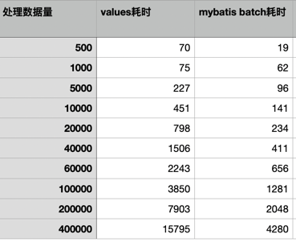
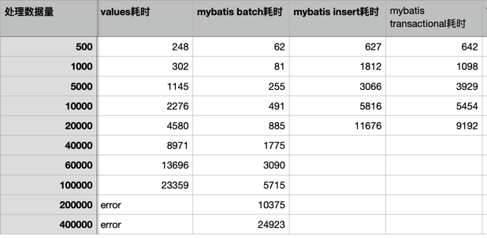
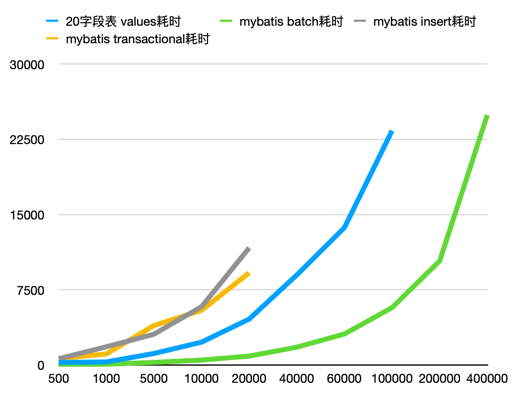
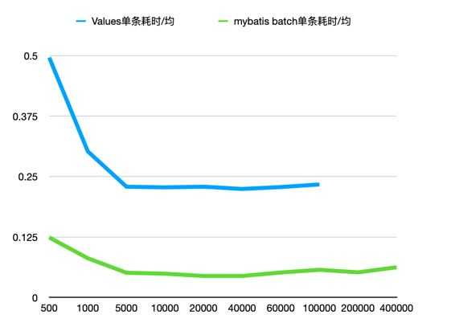
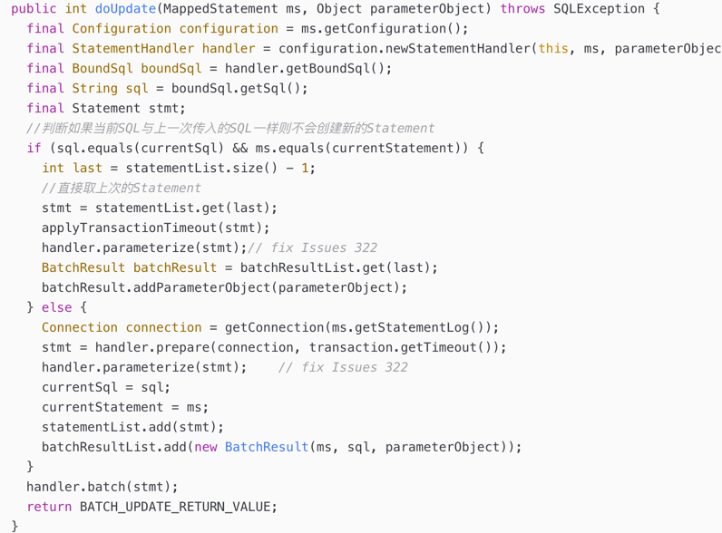

## 问题
mysql批量插入大量数据，不同的表字段、数据量大概耗时？不同的的插入方式区别？

## 猜想

    方法一：for循环一条条插入
    方法二：for循环一条条插入（放在一个事务里面）
    方法三：使用insert .. values(),()...语句
    方法四：使用mybatis batch模式

## 实验数据
### 4个字段表

### 20个字段表

## 分析(以20字段为例)

从耗时上看，mybatis batch耗时最短，values其次，常规插入最差
> 若要保证单个事务耗时在200毫秒以内，
> mybatis batch单次处理数据量要在5k以内；
> values单次处理数据量要在500以内。

从单条耗时上看，mybatis batch也是最优
> 从插入效率上看，5k条左右时，插入效率已经达到最大
 
## 结论
从本次实验环境的结果上看，使用mybatis batch效果最佳。
在一般生产环境（20字段）下，使用mybatis batch单次处理5k条数据，即可以使插入效率达到最大，也可控制事务耗时在200ms以内。

## 思考
### 为什么mybatis batch快
Batch模式减少了SQL预编译的次数

### 测试结果的局限性
本次测试数据库为本地，实际情况下还会有网络的开销。
具体的生产环境需要以生产环境的测试结果为准，本测试结果仅供参考。

## 参考
Batch中减少了SQL预编译的次数
https://blog.csdn.net/manba_out/article/details/126023101

10万条数据批量插入，到底怎么做才快？
https://www.imooc.com/article/321536